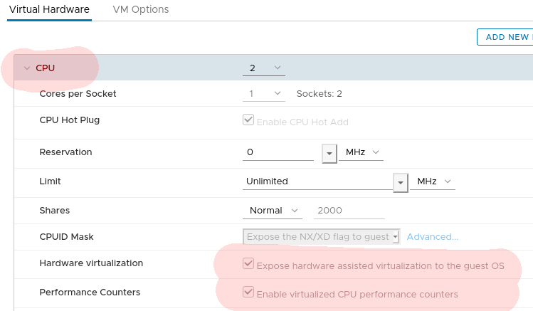

<!-- TOC -->

- [1. samutev: Salt Multipass Test Vm's](#1-samutev-salt-multipass-test-vms)
    - [1.1. requirements](#11-requirements)
    - [1.2. configuration](#12-configuration)
    - [1.3. usage](#13-usage)
    - [1.4. vmware-vm settings](#14-vmware-vm-settings)
    - [1.5. some details](#15-some-details)
        - [1.5.1. directories](#151-directories)
        - [1.5.2. performance](#152-performance)

<!-- /TOC -->

# 1. samutev: Salt Multipass Test Vm's

samutev helps you to deploy quickly local test vm's using multipass.

Test-vm's can be deployed either as masterless minion or as a master with minions.  
The resulting test-vm's are preconfigured with working saltstack.  
Inside the test-vm's the salt directories are mapped to /srv/salt/*  

## 1.1. requirements
- a [salt-repo-base-directory (salt_base)](configuration) with cloned repos `salt-states` and `salt-pillars` of your project inside
- multipass (`apt install snapd; snap install multipass`)
- enough place for created vm-disks in `/var`
- enough memory forthe vm's - according to application needs
- internet connection (for things like package install)

## 1.2. configuration

If you are working first time with samutev, do once `cp samutev.conf.template samutev.conf`

In `samutev.conf` customize these settings to your need:
1. `salt_base=""`
2. `my_ssh_pub_key=""`

_First_ setting should be the directory of your salt project, where salt-states and salt-pillars reside.  
_Second_ setting is used to deploy the ssh-pub-key to each launchend vm to `root` and to the normal user `user`. So you do `ssh root@<vm-ip>` or `ssh user@<vm-ip>`

Further, in `samutev.conf` you can customize [cloudinit](https://cloudinit.readthedocs.io/en/latest/) to bootstrap the vms.


## 1.3. usage
```
./samutev.sh -h
Usage:
    ./samutev.sh -h          # Display this help message.
    ./samutev.sh -n <VM>     # new <VM> with masterless minion
    ./samutev.sh -s <VM>     # new <VM> with minion and salt master. FIRST vm=saltmaster. minimum 2 vm's
    ./samutev.sh -d <VM>     # delete <VM>
    ./samutev.sh -l          # list   VM's

Examples:
    # --- masterless minions
    ./samutev.sh -n  testvm                     # launch new testvm              as masterless minion
    ./samutev.sh -n 'testvm1 testvm2 testvm3'   # launch multiple new testvm's   as masterless minions
    ./samutev.sh -n 'testvm1:c2:m1:d3 testvm2:c4:m2'
                                                # launch multiple new testvm's   as masterless minions
                                                #   with special settings for cpu, memory and disk
                                                #   testvm1 with 2 cpu, 1GB memory and 3GB disk
                                                #   defaults are c2 m1 d3
    
    # --- one salt-master with at least one minion
    ./samutev.sh -s 'salt-master1 testvm1 testvm2 testvm3'
                                                # launch a saltmaster with multiple new testvm's
                                                #   FIRST vm = saltmaster
                                                #   minimum = 2 vm's
    ./samutev.sh -s 'salt-master1:c2:m2:d6 testvm1'
    
    # --- delete test vm's
    ./samutev.sh -d  testvm                     # delaunch/delete testvm
    ./samutev.sh -d 'testvm1 testvm2 testvm3'   # delaunch/delete multiple testvm's
```

## 1.4. vmware-vm settings
Folgende Settings sind für eine VMware-VM erforderlich:


## 1.5. some details

### 1.5.1. directories
In the configured `$salt_base` (`samutev.conf`) two directories will be created, if not already there:
- `localstore/`  -   configured as `file_roots`  
   place to put states or binaries - outside of git repos
- `salt-dev-pillars/devpillars.sls`  -    configured as `pillar_roots`  
   place to put you dev-pillars - outside of git repos

Both directories will be available either to the salt master or tom asterless minions directly


### 1.5.2. performance
some meassured times, create 4 vm's, 1 salt-master and 3 minions:  
`samutev.sh -s "project-master project-app project-db project-web"`  

environment | time
------------|------
vm Testcluster (4GB RAM)| 10:49 min
x390 (16GB)| 04:27 min